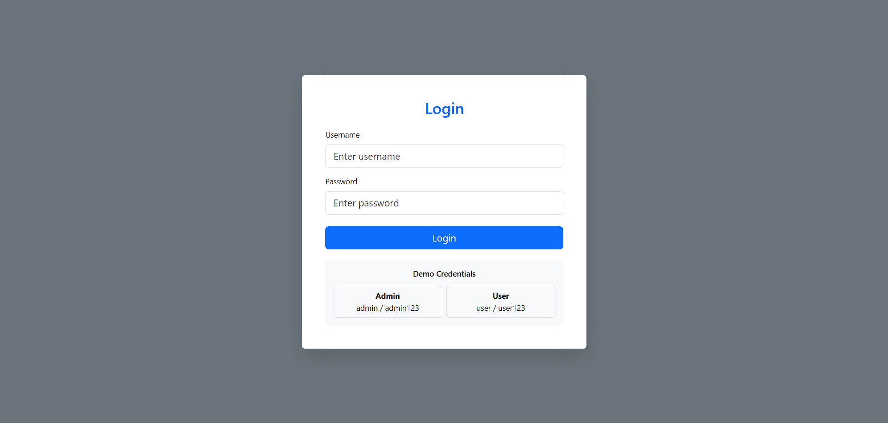
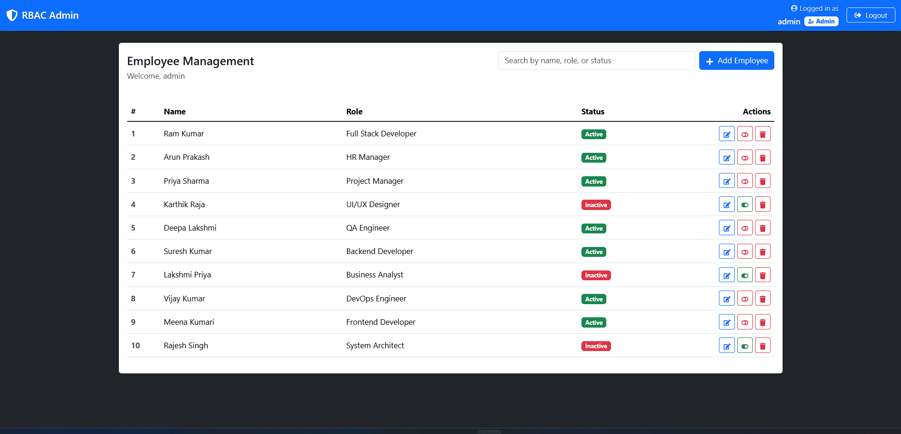
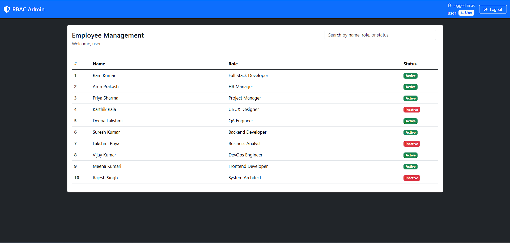

# **RBAC Admin Dashboard**

## **Overview**
The **RBAC (Role-Based Access Control) Admin Dashboard** is a React-based web application designed to streamline user role and permission management. It provides administrators with an intuitive interface to manage employees, assign roles, and control access levels efficiently.

---

## **Screenshots**

### 1. Login Page


### 2. Admin Dashboard


### 3. User Dashboard



---

## **Features**
- 🔐 **Secure Authentication**: Role-specific login for admins and users.
- 👥 **User Management**: Add, edit, delete, and view employee details.
- 🎭 **Role-Based Access Control**: Grant permissions based on roles.
- 📊 **Interactive Dashboard**: Visualize key metrics and employee data.
- 📱 **Responsive Design**: Optimized for mobile, tablet, and desktop devices.
- 🌓 **Light/Dark Theme**: Toggle between themes for better usability.
- 🔔 **Toast Notifications**: Real-time feedback for user actions.
- 📋 **CRUD Operations**: Fully functional employee management system.

---

## **Tech Stack**
- **Frontend**: React.js, React Router
- **Styling**: React Bootstrap, CSS3, Font Awesome
- **Utilities**: React Toastify

---

## **Prerequisites**
- **Node.js**: v14 or higher
- **npm**: v6 or higher

---

## **Installation**

1. **Clone the Repository**
   ```bash
   git clone https://github.com/Jeyasurya23/rbac-admin.git
   ```
2. **Navigate to the Project Directory**
   ```bash
   cd rbac-admin
   ```
3. **Install Dependencies**
   ```bash
   npm install
   ```
4. **Start the Development Server**
   ```bash
   npm start
   ```

---

## **Project Structure**
```
rbac-admin/
├── public/
│   ├── index.html
│   └── favicon.ico
├── src/
│   ├── components/
│   │   ├── Dashboard.js
│   │   ├── Login.js
│   │   └── Navbar.js
│   ├── styles/
│   │   ├── Dashboard.css
│   │   ├── Login.css
│   │   └── Navbar.css
│   ├── App.js
│   └── index.js
└── README.md
```

---

## **Usage**

### **Login**
- Use the following test credentials:
  - **Admin**:  
    Email: `admin@example.com`  
    Password: `admin123`
  - **User**:  
    Email: `user@example.com`  
    Password: `user123`

### **Dashboard Features**
- **View Employees**: See a list of all employees with details.
- **Add Employees**: Create new employee records.
- **Edit Details**: Update employee information.
- **Change Status**: Activate or deactivate employees.
- **Delete Employees**: Remove employees from the system.
- **Filter/Search**: Quickly locate employees by name, role, or status.

---

## **Responsive Design**
The dashboard is optimized for a variety of devices:
- 📱 **Mobile Devices** (<576px)
- 📱 **Tablets** (577px - 768px)
- 💻 **Small Laptops** (769px - 992px)
- 🖥️ **Desktops** (>992px)

---

## **Contributing**

1. **Fork the Repository**
   ```bash
   git fork https://github.com/Jeyasurya23/rbac-admin.git
   ```
2. **Create a Feature Branch**
   ```bash
   git checkout -b feature/YourAmazingFeature
   ```
3. **Commit Your Changes**
   ```bash
   git commit -m "Add YourAmazingFeature"
   ```
4. **Push the Changes**
   ```bash
   git push origin feature/YourAmazingFeature
   ```
5. **Open a Pull Request**

---

## **License**
This project is licensed under the [MIT License](LICENSE).

---

## **Contact**
- **Developer**: Jeyasurya  
- **Twitter**: [@_Jeyasurya](https://x.com/_Jeyasurya)  
- **Project Repository**: [RBAC Admin Dashboard](https://github.com/Jeyasurya23/rbac-admin)

---

## **Acknowledgments**
- [React Bootstrap Documentation](https://react-bootstrap.github.io/)
- [Font Awesome](https://fontawesome.com/)
- [React Toastify](https://fkhadra.github.io/react-toastify/)
